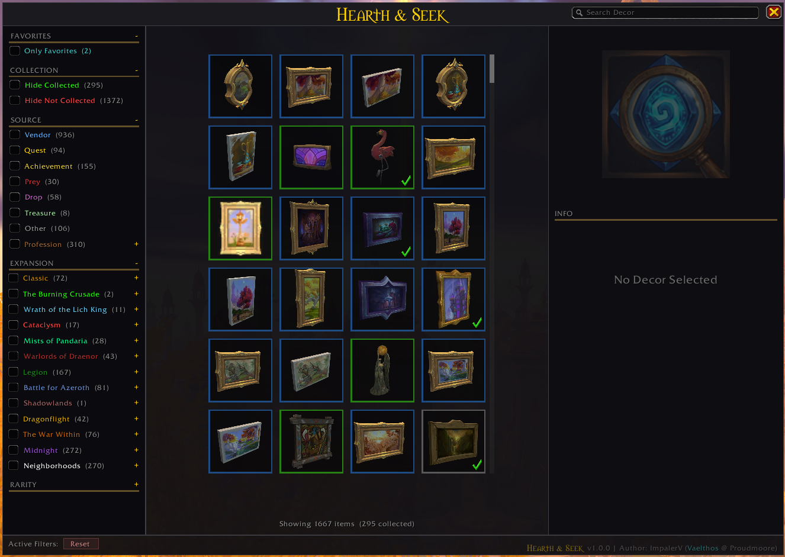
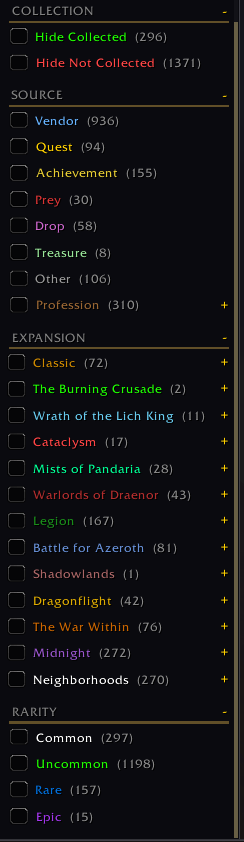
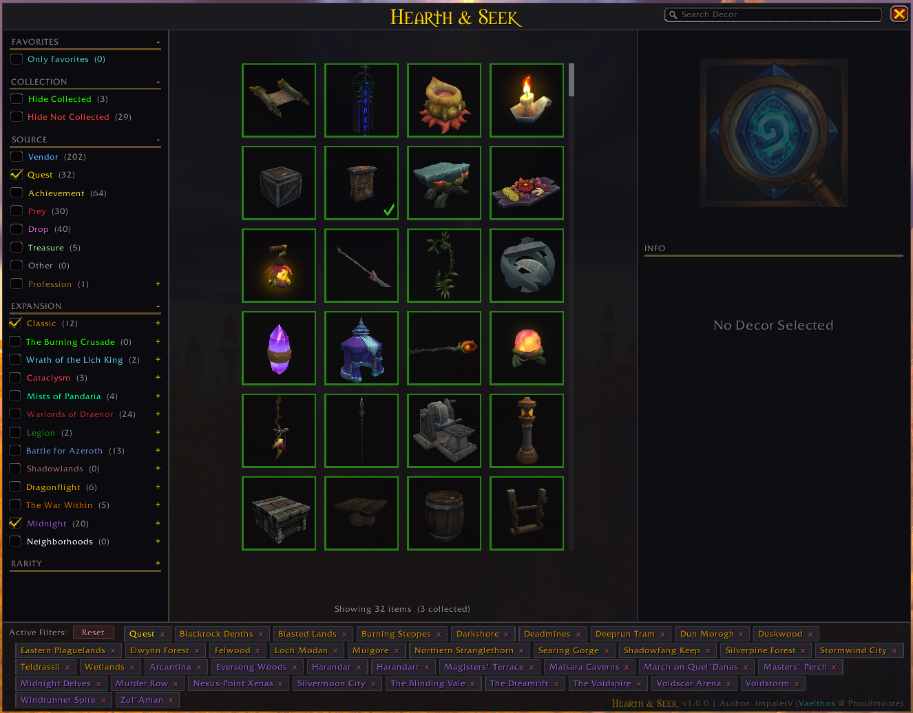
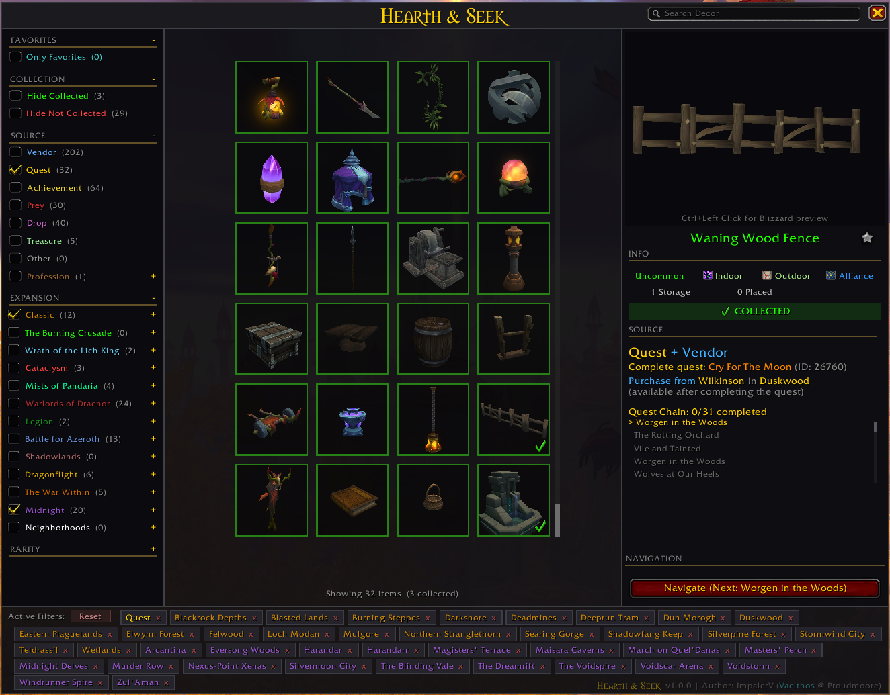
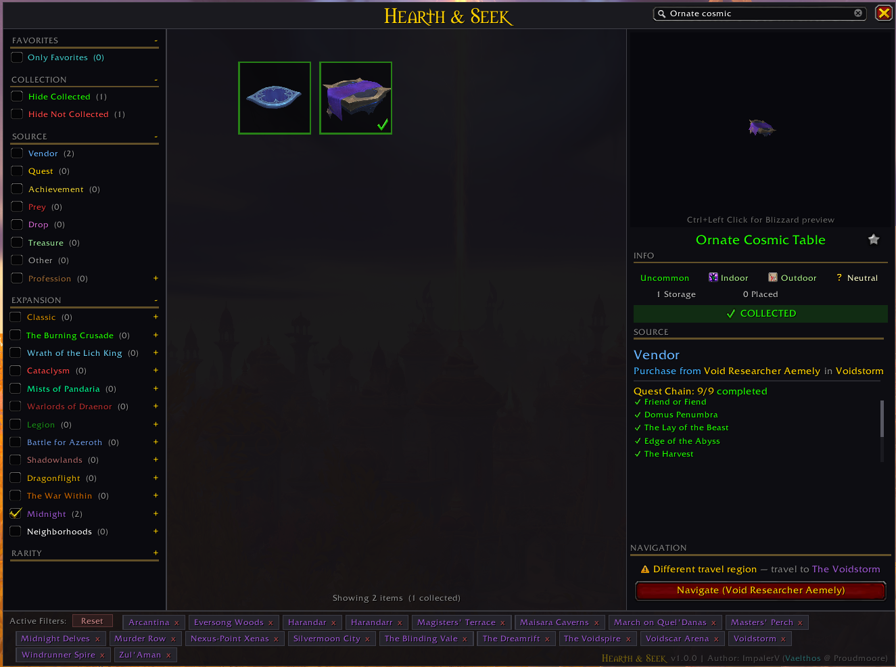
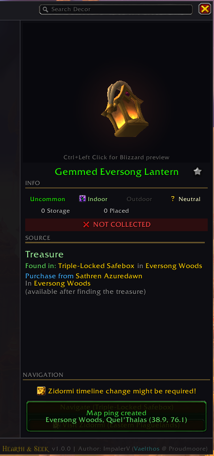
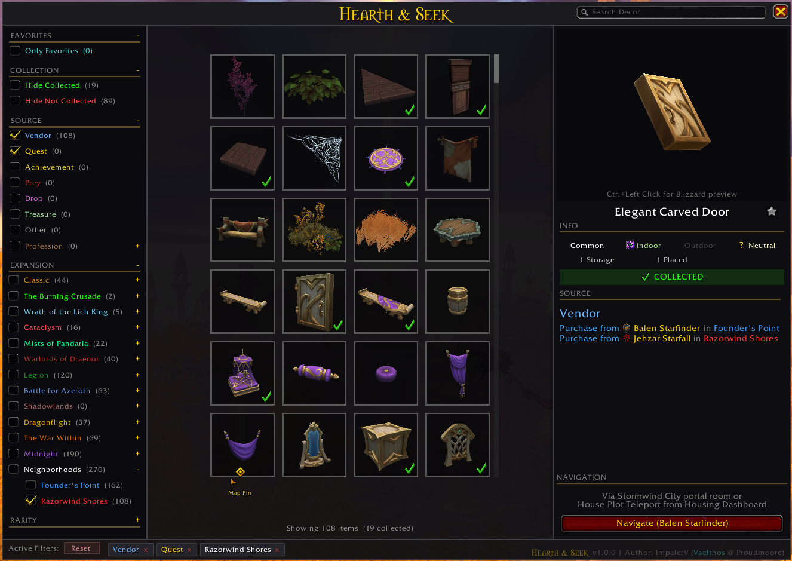

# Hearth & Seek: Decor Catalog

A visual catalog of all Player Housing decorations in World of Warcraft, with collection tracking, source guides, and in-game navigation.



## Features

- **Browse 1,600+ decorations** in a grid with 3D model previews
- **Collection tracking** — see what you own, what's placed, and what's still missing
- **Source guides** — every item shows exactly how to get it (vendor, quest, achievement, drop, treasure, profession, or prey)
- **Filter and search** — filter by source type, expansion, zone, profession, rarity, and collection status, all with live item counts
- **Quest chain tracking** — step-by-step progress through prerequisite quest chains with navigation to the next quest giver
- **In-game navigation** — coordinates and map pins for vendors, treasures, and drop locations using Blizzard's built-in navigation system
- **Favorites** — star decorations you're interested in for quick access later
- **Faction vendor support** — shows Alliance and Horde vendors side by side, including Neighborhood rotating vendors
- **Smart navigation** — handles cross-continent travel warnings, dungeon entrance pins, and Zidormi timeline zones

## Installation

### From CurseForge

Download from [CurseForge](https://www.curseforge.com/wow/addons/hearth-and-seek) or install via any addon manager (CurseForge app, WowUp, etc.).

### Manual Install

1. Download the latest release zip from [Releases](https://github.com/ImpalerV/HearthAndSeek/releases)
2. Extract the `HearthAndSeek` folder into your WoW AddOns directory:
   ```
   World of Warcraft/_retail_/Interface/AddOns/HearthAndSeek/
   ```
3. Restart WoW or type `/reload`

## Usage

- `/hs` or `/hideandseek` — Toggle the catalog window
- Click any decoration in the grid to see its details, source, and navigation options
- Use the sidebar filters to narrow down what you're looking for
- Click **Set Waypoint** or **Navigate** to get map pins and directions

## Screenshots

| | |
|---|---|
|  |  |
|  |  |
|  |  |

## Data Coverage

The catalog covers decorations from **Classic through Midnight (12.0)** and will be updated as new decorations are added in future patches.

## Development

### Data Pipeline

The catalog data is generated by a Python pipeline that parses in-game dumps and enriches them with data from Wowhead. See [Tools/scraper/README.md](Tools/scraper/README.md) for full pipeline documentation.

### Building from Source

1. Copy `deploy.config.example.json` to `deploy.config.json` and set your WoW path
2. Copy `dev.config.example.json` to `dev.config.json` and set your WoW path
3. Deploy to WoW:
   - PowerShell: `scripts/deploy.ps1`
   - Bash: `scripts/deploy.sh`
   - Pipeline: `python Tools/scraper/run_pipeline.py --deploy`

### Project Structure

```
HearthAndSeek/
  Core/           # Addon initialization, constants, utilities
  Data/           # Generated catalog data (CatalogData.lua, QuestChains.lua)
  Modules/        # Navigation system, catalog dumper
  UI/             # Catalog browser UI (grid, detail panel, filters)
  Libs/           # Bundled libraries (LibStub, LibDBIcon, etc.)
  Media/          # Icons and textures
  Tools/scraper/  # Python data pipeline (parse, enrich, generate)
  scripts/        # Deploy and packaging scripts
```

## License

[MIT License](LICENSE)

## Credits

Created by **ImpalerV** (Vaelthos @ Proudmoore)

Special thanks to **Nemilosu** @ Kazzak (EU) for helping test the addon.
